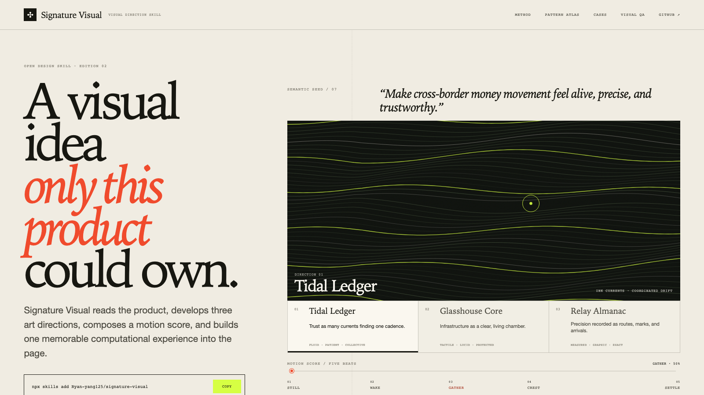
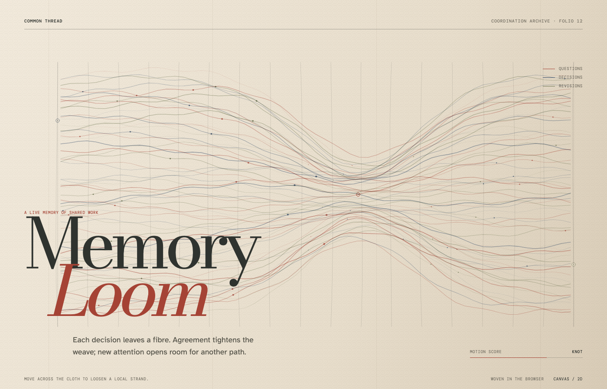
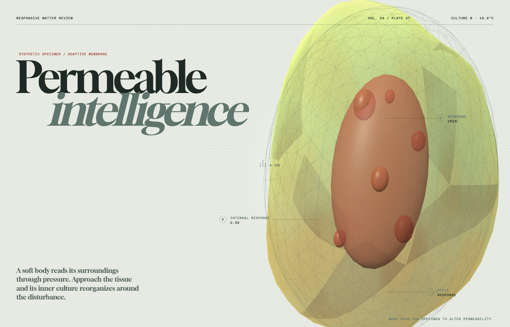
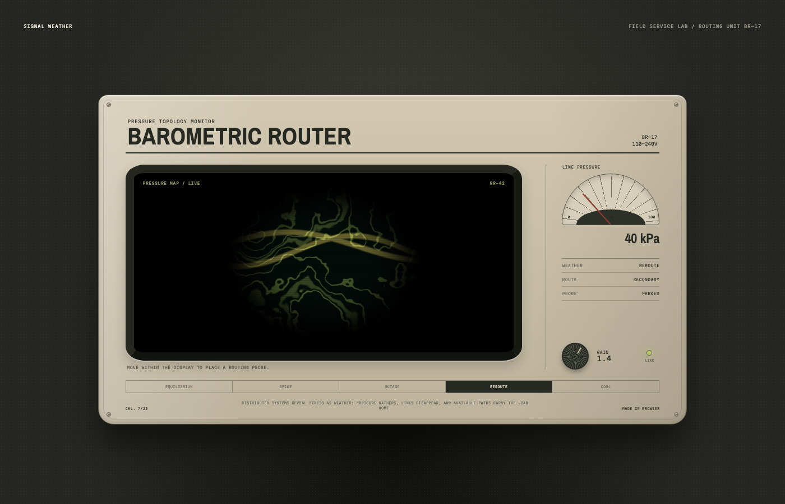
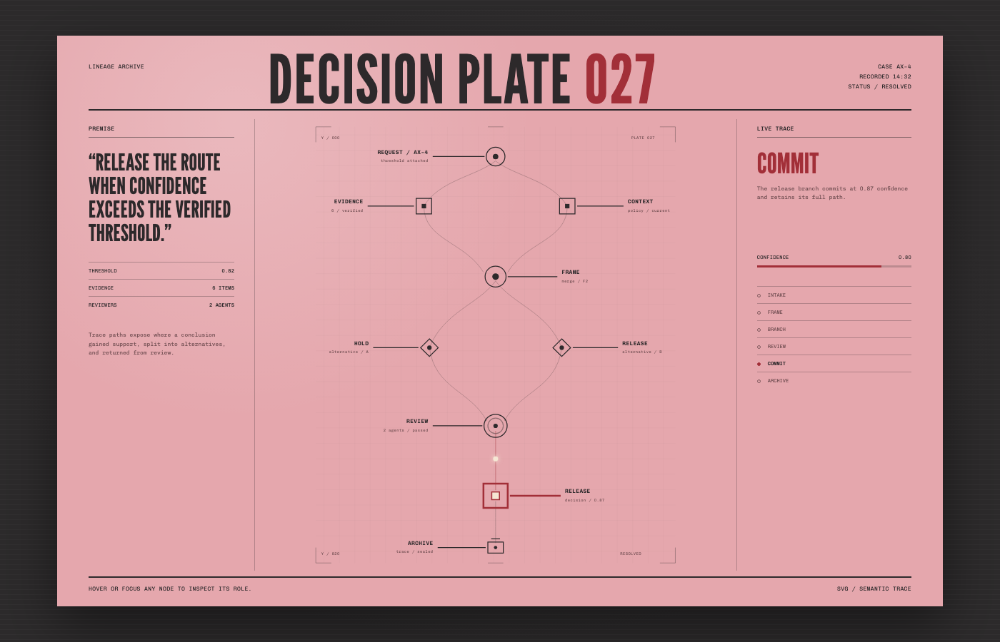

# Signature Visual

**A self-contained visual direction Skill for memorable computational experiences on the web.**

[Live website →](https://signature-visual.pages.dev) &nbsp;·&nbsp; [Install](#install) &nbsp;·&nbsp; [How it works](#how-it-works) &nbsp;·&nbsp; [Visual QA](#deterministic-visual-qa)

<p align="center">
  <a href="https://signature-visual.pages.dev">
    
  </a>
</p>

People ask for a page to feel alive, trustworthy, spatial, precise, strange, or memorable. Signature Visual translates that intent into a product-specific visual thesis, develops three structurally different art directions, composes material and motion, selects the rendering engine, implements the system, and reviews deterministic visual states.

It can add one signature moment to an existing page, redesign a familiar-looking effect, study an HTML or visual reference, or systemize several related moments.

## Install

```bash
npx skills add Ryan-yang125/signature-visual
```

Re-run the command to update. The package follows the portable `SKILL.md` convention and carries no external Skill dependency.

Manual installation works by copying [`skills/signature-visual/`](skills/signature-visual/) into the Skill directory used by your agent:

- Claude Code: `~/.claude/skills/signature-visual/`
- Codex: `~/.codex/skills/signature-visual/` or `.codex/skills/signature-visual/`
- Cursor and other agents: keep `SKILL.md`, `references/`, and `scripts/` together in the agent's rule or Skill path

## V2: visual direction comes first

V2 addresses the most common failure in computational web design: technically capable effects converging on the same visual identity.

The Skill now requires:

1. a product-grounded visual thesis and paired motion verbs;
2. three Direction Cards with different fingerprints and silhouettes;
3. evidence-based selection through specificity, composition, distinctness, system fit, and feasibility;
4. an authored composition, material system, motion score, interaction contract, and signature rule;
5. renderer selection after the direction is clear;
6. implementation from neutral lifecycle shells;
7. deterministic contact sheets across key states, mobile, and reduced motion;
8. critique and targeted revision for every quality score below four.

The result can expand into a family of related visuals while retaining one recognizable motion and material language.

## Live cases

The four case studies share a production standard and deliberately occupy different design worlds.

<table>
  <tr>
    <td width="50%"><a href="https://signature-visual.pages.dev/examples/particle-current/"></a></td>
    <td width="50%"><a href="https://signature-visual.pages.dev/examples/living-orb/"></a></td>
  </tr>
  <tr>
    <td><b>Memory Loom</b><br/><sub>Canvas 2D · coordination as fibres that gather, cross, knot, and release</sub></td>
    <td><b>Permeable Intelligence</b><br/><sub>Three.js · a synthetic specimen whose boundary admits, responds, and repairs</sub></td>
  </tr>
  <tr>
    <td><a href="https://signature-visual.pages.dev/examples/radiance-field/"></a></td>
    <td><a href="https://signature-visual.pages.dev/examples/spatial-lineage/"></a></td>
  </tr>
  <tr>
    <td><b>Signal Weather</b><br/><sub>Raw WebGL · equilibrium, spike, outage, reroute, and cool inside a physical instrument</sub></td>
    <td><b>Decision Plate 027</b><br/><sub>Semantic SVG · evidence, branching, review, commitment, and archive in one trace</sub></td>
  </tr>
</table>

Each case has an authored mobile composition, a designed reduced-motion state, complete lifecycle cleanup, and a deterministic `window.__signatureVisual` bridge. Showcase fonts and Three.js are self-hosted, with a tested static fallback for unavailable GPU contexts.

## How it works

```text
real page + ambiguous creative intent
        ↓
page job + content axis + brand signal + constraints
        ↓
visual thesis + core verb / counter-verb
        ↓
three divergent Direction Cards
        ↓
composition + material + motion score + interaction
        ↓
Canvas 2D / Three.js / raw WebGL / SVG
        ↓
deterministic states → contact sheet → critique → revision
        ↓
responsive, accessible, lifecycle-complete implementation
```

### Originality contract

Every direction receives a visual fingerprint:

```text
artifact stance / spatial archetype / scale / density
material / temporal character / response / type role
```

A source study separates portable principles from recognizable surface identity. The target changes at least three axes and receives a new combination of composition, palette, typography, material, motion, and interaction.

### Pattern atlas

Ten technology-independent pattern cards widen the search space:

| Pattern | Core idea | Strong fit |
| --- | --- | --- |
| Coherent Field | local decisions expose a larger invisible rule | coordination, logistics, collective systems |
| Living Boundary | identity emerges through an adaptive enclosure | biology, security, communities |
| Sediment Archive | time remains visible through deposits and strata | provenance, memory, climate |
| Signal Instrument | an invisible process becomes measurable | infrastructure, diagnostics, audio |
| Luminous Threshold | change appears where fields or states meet | transitions, energy, discovery |
| Morphogenetic Growth | local rules create a living structure | ecosystems, learning, creativity |
| Trace Topology | routes and constraints explain relationships | workflows, lineage, dependencies |
| Kinetic Index | language becomes spatial and temporal material | search, publishing, mapping |
| Spatial Assemblage | parts reveal identity through assembly | platforms, modular products, craft |
| Anomalous System | one deviation exposes an ordered world's rules | risk, quality, monitoring |

Each card contains semantic uses, spatial grammar, material language, a motion score, interaction mapping, broad mutation axes, capture checkpoints, cheap-look diagnostics, and a source-distance rule. Pattern cards generate design spaces; they do not lock projects to finished templates.

## Deterministic Visual QA

The bundled QA CLI captures the exact states an interactive visual was designed to contain.

```bash
npm run visual-qa -- path/to/manifest.json
```

It supports:

- timeline progress and ambient fixed-time states;
- scripted pointer approach, engagement, release, and recovery;
- fixed epoch, virtual clock, seeded randomness, viewport, DPR, locale, color scheme, and motion preference;
- the standard `window.__signatureVisual` control bridge;
- console, page, and network error diagnostics;
- PNG hashes, structured results, and a dependency-free HTML contact sheet.

Print a manifest example:

```bash
npm run visual-qa -- --print-example
```

Run every desktop motion score, four mobile peak states, and four reduced-motion stills:

```bash
npm run visual-qa:cases
```

The review compares composition, content safety, material consistency, phase continuity, product meaning, source distance, mobile behavior, and reduced motion. See [visual-qa.md](skills/signature-visual/references/visual-qa.md) and [failure-signatures.md](skills/signature-visual/references/failure-signatures.md).

## Skill architecture

The progressive-disclosure structure keeps the core workflow concise and loads specialized knowledge only when the task needs it.

```text
skills/signature-visual/
├── SKILL.md                         # visual-director workflow
├── agents/openai.yaml              # Codex interface metadata
├── scripts/
│   ├── visual-qa.mjs               # deterministic capture + contact sheets
│   └── visual-qa.test.mjs          # repeatability and failure-path tests
└── references/
    ├── visual-direction.md         # thesis, tension, artifact stance
    ├── composition.md              # spatial archetypes, type, mobile
    ├── material-language.md        # substance, light, edge, texture
    ├── motion-direction.md         # phases, tempo, curves, recovery
    ├── pattern-language.md         # ten generative pattern cards
    ├── reference-study.md          # fingerprints and transformation matrix
    ├── interaction.md              # semantic mapping and bounds
    ├── routing.md                  # experience → renderer
    ├── integration.md              # ownership, clocks, lifecycle, fallback
    ├── visual-qa.md                # capture and critique protocol
    ├── failure-signatures.md       # visible diagnosis and revision order
    ├── families/                   # Canvas, Three.js, WebGL, SVG depth
    └── starters/                   # neutral lifecycle runtime shells
```

The runtime shells own sizing, DPR, visibility, input, reduced motion, deterministic controls, and teardown. The agent supplies a project-specific visual program: geometry, field equations, emitters, material, composition, timing, and semantics.

## Example prompts

```text
The hero feels visually generic. Give it one memorable moment that communicates how many independent agents arrive at a shared decision. Keep our existing React stack and make the mobile composition feel intentional.
```

```text
This biotechnology hero has a glowing displaced sphere and feels familiar. Redesign the visual around selective permeability: an external signal crosses the membrane, changes the interior, then the organism heals.
```

```text
Study this HTML reference. Extract the spatial, material, and temporal rules that give it conviction, then develop three fresh directions for our archival search product. Keep the result structurally distant from the source.
```

```text
Our SVG provenance diagram is crowded on mobile and every route moves continuously. Re-direct it around one decision trace from evidence to signed output, with keyboard, touch, and reduced-motion states.
```

## Repository

```text
.
├── skills/signature-visual/        # installable universal Skill
├── site/                           # public site and four live cases
├── evals/                          # independent scenarios and rubric
├── docs/direction-case-study.md    # worked director decision
├── ACKNOWLEDGEMENTS.md             # research and license boundaries
└── .github/workflows/verify.yml    # Skill, browser, and QA verification
```

The Skill's methods and scripts are self-contained. A target project can use its existing animation or rendering libraries when they serve the selected direction. The Three.js runtime shell expects the target to provide `three`; the QA CLI uses Playwright when available.

## Develop and verify

```bash
npm install
npx playwright install chromium
npm run build:site
npm run serve
npm run check
npm run test:visual-qa
npm run visual-qa:cases
npm run screenshots
```

`npm run check` verifies Skill links and size, JavaScript syntax, required V2 resources, all four runtime shells and controller methods, teardown, desktop/mobile pages, deterministic bridges, reduced motion, overflow, and browser errors.

The independent evaluation set lives in [`evals/scenarios.json`](evals/scenarios.json), with the acceptance rubric in [`evals/rubric.md`](evals/rubric.md).

## Research and license

The package architecture draws inspiration from [Hallmark](https://github.com/Nutlope/hallmark). Motion, renderer, and deterministic-review research is documented with source and license boundaries in [ACKNOWLEDGEMENTS.md](ACKNOWLEDGEMENTS.md).

Signature Visual is released under the [MIT License](LICENSE).
